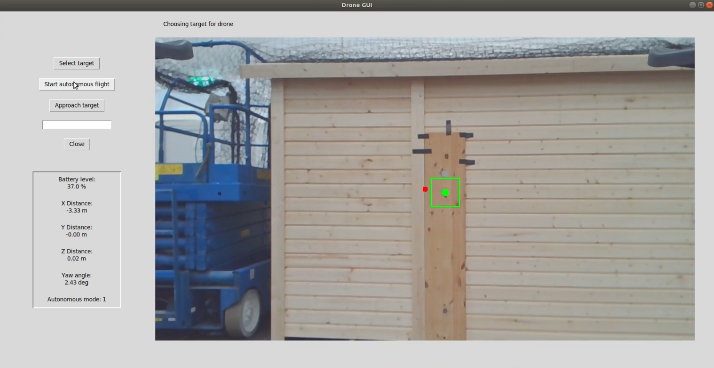

# Visual feature tracker for visual servoing and targeting
This package contains 2 feature trackers to be used for feature targeting or visual servoing. It also contains a graphical interface for the user to select the desired target and send messages to the autonomous program.

**REQUIREMENTS**
* Python 2
* ROS Melodic
* OpenCV > 3.4
* cv_bridge
* GUI exclusive:
    * Pillow (python)
    * Tkinter (python)
    * image_transport for image decompression

## Usage
Run one of the tracker nodes (`csrt_tracker.py` or `lt_tracker.py`). These subscribe to an image topic, e.g. `/usb_cam/image_raw`, the user selected target to track `/gui_target` and the current position to the wall, e.g. `/dtu_controller/current_frame_pose`.

The trackers will publish the current location of the target on the image on the topic `/target` and calculate the distance errors to the target based on the subscribed distance to the wall on `/distance_error`.

The GUI is launched with the launch-file `gui.launch` which also starts the image decompression node. The GUI shows the currently decompressed image on `/camera/image_decompressed`. Using the GUI the user can get current status information as well as use the buttons to change the flight behavior and select a target to track.

## Scripts

### `lt_tracker.py`
Tracker based on the bachelor project of Laura and Tobias. It tracks and matches ORB features between two consecuitive images. This tracking scheme assumes that all the features are on the same plane right in front of the camera so that they will all move in a similar manner. From this assumtion the feature  selected will also have moved the same distance. 

### `csrt_tracker.py`
This tracker uses the CSRT tracker implemented in OpenCV. When a point is selected a 30x30 pixel bounding box is selected around the point and tracked. 

### `visual_gui_v2.py`
GUI for selecting the target and starting autonomous flight for the controller.

### `visual_gui.py` (OLD)
Old version of the gui. Similar to v2 and Might work, but has less features.